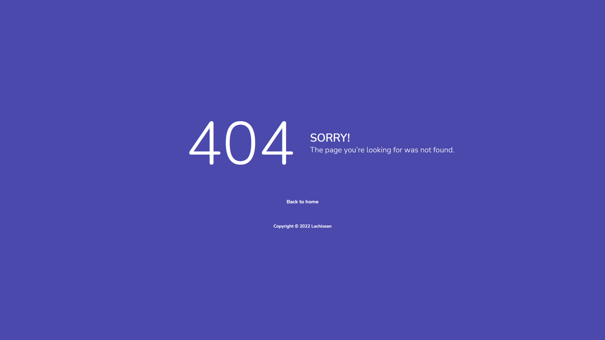

# UTS IF330 - Web Programming

## 📝 [Note Lachisean](http://note-lachisean.rf.gd)
Website: <http://note-lachisean.rf.gd>

## 👥 Kelompok Lachisean
```
1. 40107 - Laras Wulandari Agfaningrum
2. 43324 - Christopher Matthew Marvelio
3. 28367 - Stefano Irvinne Iversen
4. 27923 - Arif Novianto
```

## 🚀 Feature/fungsi tambahan
- Terdapat fitur search, dimana user dapat mencari keyword untuk title note. Note akan dicari mulai dari private, shared note yang dibagikan kepada user, dan public note
- Halaman profile user lain berisi profile, public notes, dan shared notes yang diberikan ke user yang sedang login dari user lain
- Terdapat halaman error 403, 404, dan 500. User akan diredirect ke halaman error tersebut ketika terjadi masalah dengan server/website

- Notes yang dibuat oleh user dapat mengandung text yang berupa barisan kode. Kode dalam notes tidak akan dijalankan, melainkan ditampilkan sebagai plaintext
- Terdapat indikator pada preview note jika note memiliki attachment
- Saat melakukan proses register, user harus melakukan konfirmasi terhadap password yang telah diinput untuk mencegah kesalahan pengetikan
- User tidak dapat membuat akun jika sudah ada akun dengan username yang sama
- Terdapat pesan error ketika user ingin membagikan notes ke user lain tetapi username tersebut tidak ditemukan
- Terdapat pesan success ketika user berhasil membuat, mengedit, atau menghapus note dan account
- Saat mengedit note dengan attachment, user dapat memilih untuk tetap melampirkan/menghapus seluruh attachment
- Ketika ingin mengubah data account, user tidak dapat mengganti username baru jika username tersebut sudah diambil oleh orang lain
- Ketika mengupload file yang bukan berupa gambar untuk dijadikan profile picture, pesan error akan muncul dan data tidak akan disimpan

## 💾 Skema Database


## 📸 Screenshots





